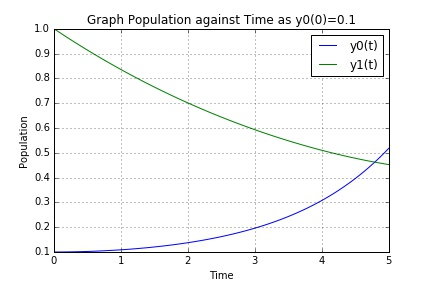
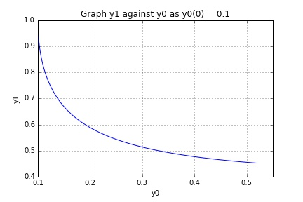
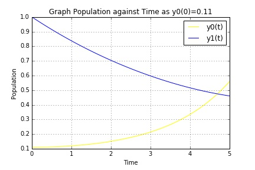
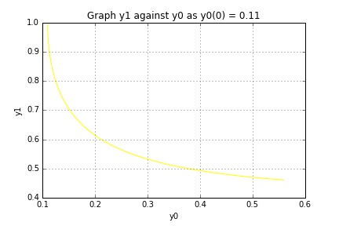

UECM3033 Assignment #3 Report
========================================================

- Prepared by: ** ANG HUANG YING**
- Tutorial Group: T2

--------------------------------------------------------

## Task 1 --  Gauss-Legendre formula

The reports, codes and supporting documents are to be uploaded to Github at: 

https://github.com/anghuangying/UECM3033_assign3.git

Explain how you implement your `task1.py` here.

First of all, define the function of def gausslegendre(f,a,b,n=20) to find the Gauss-Legendre quadrature.  wf is defined as weight multiply the function and therefore it is initialize to 0. The sample points as X and weights as W were computed for Gauss-Legendre quadrature. These sample points and weights will correctly integrate polynomials over the interval [-1, 1] with the weight function. Furthermore, the weight and function will sum up to n times by for loops. By changing the interval, translate x values from [-1, 1] to [a, b] using $$ y = \frac{b-a}{2}x + \frac{b+a}{2} $$ and then scale the Gaussian quadrature formula by $$ \frac{b+a}{2} $$. Hence, it results to $$\int_a^{b}f(x) dx= \frac{b-a}{2}\int_{-1}^{1} f(\frac{b-a}{2}x + \frac{a+b}{x} ) dx$$

Explain how you get the weights and nodes used in the Gauss-Legendre quadrature.

The weights and nodes used in the Gauss-Legendre quadrature can be obtained by legendre polynomial module in python which is numpy.polynomial.legendre.leggauss.

---------------------------------------------------------

## Task 2 -- Predator-prey model

Explain how you implement your `task2.py` here, especially how to use `odeint`.

Firstly, ODE function was defined as d2Y_dt2 that y, t, a and b are taken into account. The differential equation also created into system as following: 
$$ y'_0 = a(y_0 - y_0 y_1)$$ $$ y'_1 = b(-y_1 + y_0 y_1)$$
where parameters a and b were given as 1.0 and 0.2 respectively. Moreover, y_initial was created as initial condition that given by both y0_initial which was 0.1 and y1_initial which was 1.0. The system of ODEs of time from 0 to 5 years were divided into 100 sections by using np.linspace(0,5,100). The solution was calculated by the ODEs function using the scipy.integrate.odeint of self-defined function, initial condition, time and arguments. Therefore, the graph of y0 and y1 against time was plotted by importing matplotlib.pyplot as plt. by plotting the graph, the number of prey, y0  was taken out the first column and y1 while the predator was taken out by the second column. Next, both the graph of population against time and the graph of y1 against y0 were constructed. The same procedure was repeated for the second part problem with the initial condition y0(0)=0.11 and y1(0)=1.0 in order to compare the sensitivity.

Put your graphs here and explain.

y0 represent as prey and y1 represent as predator.
The graph below shows that population against time when the initial condition y0(0)=0.1. It indicate that the higher the number of prey when the lower the number of predator. 

The bottom graph shows inversely relationship between the number of prey, y0 and the number of predator, y1.

When initial condition y0(0)0.11, y1 is 1.0.

Is the system of ODE sensitive to initial condition? Explain.

No, the system of ODE is not sensitive to the initial condition.  The small changes of initial condition value will cause the output changes large if the system of ODE is sensitive. As a result, the graph was obviously indicate the changes of output was small.

-----------------------------------

last modified: 16 April 2016 
